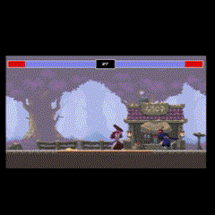
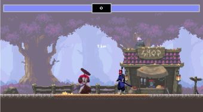

# Iron Dragon

  
    
  
   
  
   
  
   
  
   
  
  
  ## Description
   
   A web based, two player fighting game built with JavaScript and HTML canvas. 
    
   The addition of professional sprite sheets and graphics ensures the gameplay stays action packed and visually impressive. 
   Sprite animations are optimized using GSAP, a professional-grade JavaScript library so users can expect extra smooth performance.  
    
   There are two characters available, Samurai Mack (player one) and Kenji (player two). Each character has unique strengths and weaknesses which allows players to create their own winning strategy!
   
 
  ## Table of Contents
  - [Description](#description)
  - [Documentation](#documentation)
  - [Deployment](#deployment)
  - [Usage](#usage)
  - [Screenshot](#screenshot)
  - [Features](#features)
  - [Acknowledgements](#acknowledgements)
  - [License](#license)
  - [Contact](#contact)

  ## Documentation
   
   
   

  ## Deployment

  This application is deployed using GitHub Pages: <https://ratalla816.github.io/iron-dragon-2>
 
  ## Usage

  ### As a user, I want to: 
  * Play a web based two player fighting game.
  * Control movement and attacks for each player sprite simultaneously using one standard QWERTY keyboard. 
  * See a unique sprite animation that confirms each time that player sustains attack damage. 
  * View counters that display each player's remaining health and the time remaining. 
  * Choose to play as a certain character based on each character's strengths and weaknesses. 
  * See unique sprite animations that correspond to the character's movements. 

 

  ## Screenshot
  
   
   
  
  
  

  ## Features
 
 * Unique character and background sprites each with exclusive animations. 
 * Each character has a distinct set of strengths and weaknesses. 
 * UI incorporates a gane timer that counts down from 59 seconds and displays the remaining time. 
   There is also a health bar component which displays the amount of damage each character has taken, as well as their amount of remaining health. 
 * When a character's health bar reaches zero text is displayed declaring which player won. 
   In the event that the timer reaches zero and neither player has sustained damage, text is displayed declaring a tie. 
 * Each character has unique sprite animations for idle, run and jump movements. There are also special animations that confirm when a player is hit and when they have lost.  

  # Acknowledgements
  
  * Chris Courses, "JavaScript Fighting Game Tutorial": <https://www.youtube.com/watch?v=vyqbNFMDRGQ&t=47s>
  * Environment Assets: <https://brullov.itch.io/oak-woods>
    
  ## License
  
   
  Permission to use this application is granted under the MIT license. <https://opensource.org/licenses/MIT>

   ## Contact:
   Holler at me! <a href="mailto:rob.atalla@robatalla816.com">rob.atalla@robatalla816.com</a>